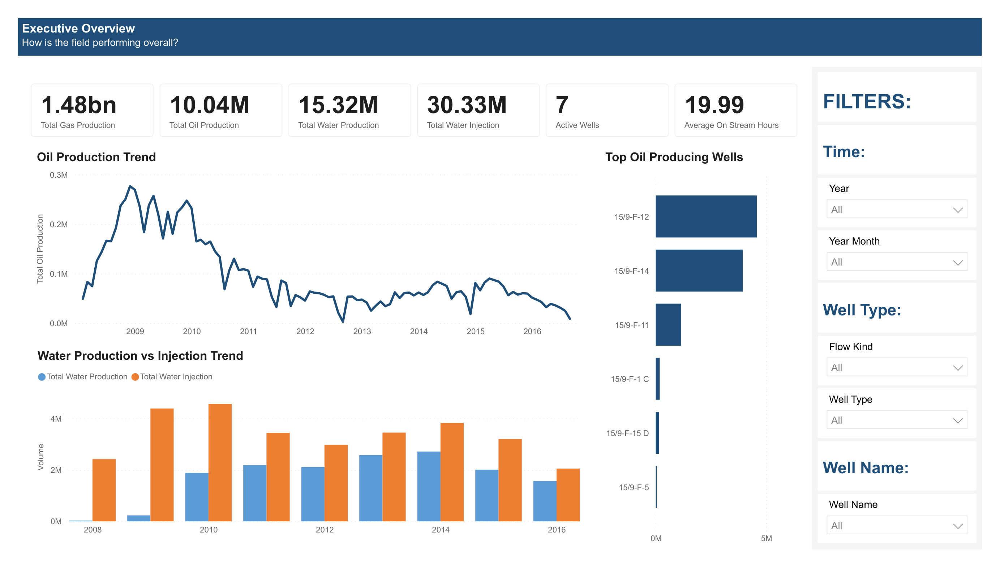
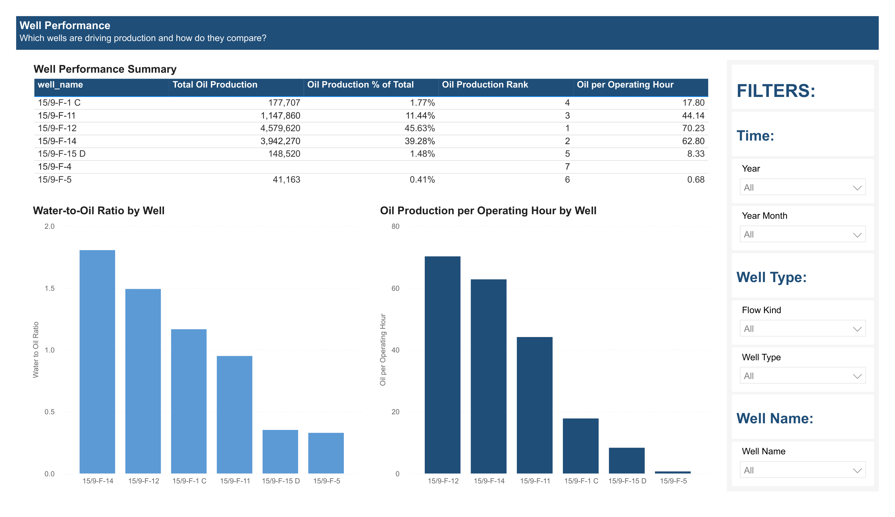
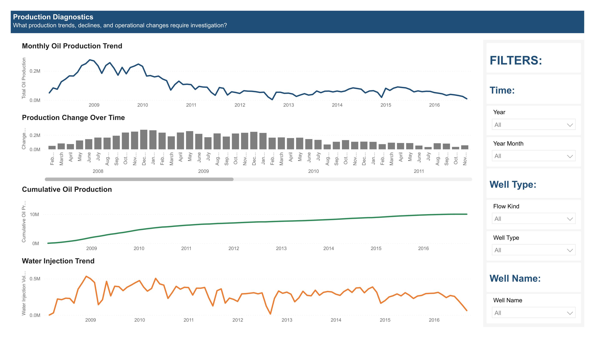

# Oil & Gas Production Performance Dashboard

Interactive Power BI dashboard analyzing production performance, well efficiency, water injection activity, and production trends for the Volve offshore oil field. The project combines SQL data modeling, dimensional design, DAX measures, and Power BI visualization to provide operational insights for production monitoring and performance analysis.

## Project Overview

The objective of this project is to analyze oil and gas production performance across wells and identify operational trends affecting field output. Using daily production data from the Volve field, the solution transforms raw operational data into a dimensional model and presents key production metrics through interactive Power BI dashboards.

## Dashboard Files

### Power BI Dashboard

[Download PBIX File](Oil_Gas_Production_Performance_Dashboard.pbix)

### Dashboard PDF

[View Dashboard PDF](Oil_Gas_Production_Performance_Dashboard.pdf)

## Tools & Technologies

- PostgreSQL
- SQL
- Power BI
- DAX
- Power Query
- Data Modeling

## Dataset

Source: Volve Daily Production Dataset (Kaggle)

- 15,634 records
- 24 columns
- September 2007 – December 2016

## Data Model

Star Schema Design:

dim_date → fact_production ← dim_well

### Dimension Tables

**dim_date**
- Production Date
- Year
- Quarter
- Month
- Month Name
- Year-Month

**dim_well**
- Well Name
- Well Bore Code
- Field Information
- Facility Information

### Fact Table

**fact_production**
- Oil Production
- Gas Production
- Water Production
- Water Injection
- On Stream Hours
- Pressure Metrics
- Temperature Metrics
- Operational Attributes

## SQL Highlights

- Data Cleaning & Type Conversion
- Dimensional Modeling
- Star Schema Design
- Window Functions
- CTEs
- Ranking Analysis
- Production Trend Analysis

## Dashboard Pages

### Executive Overview

- Production KPI scorecards
- Oil production trends
- Top producing wells
- Water production vs injection analysis

### Well Performance

- Well performance summary
- Water-to-oil ratio analysis
- Oil production efficiency comparison

### Production Diagnostics

- Monthly production trends
- Production change monitoring
- Cumulative production tracking
- Water injection trends

## Key Metrics

- Total Oil Production: 10.04M
- Total Gas Production: 1.48B
- Total Water Production: 15.32M
- Total Water Injection: 30.33M
- Active Wells: 7
- Highest Producing Well: 15/9-F-12

## Skills Demonstrated

- SQL
- Data Cleaning
- Dimensional Modeling
- Star Schema Design
- DAX
- Power BI
- Data Visualization
- Business Intelligence Reporting
- Energy Analytics
